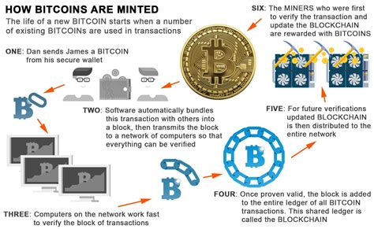

### Token & Tokenomics

Token一词，字面上来说你可以认为它是代币，通证，实际上世界各地每时每刻都有Token的流通，广义上来说你可以认为你所使用的法币，或者说Fiat Money，一种国际公司用它进行交易，公民用它交税，而如果没有它，人们将为生活的基本必需品而挣扎的一种存在。而在大多数国家，中央银行是唯一有权向其公民发行货币的机构。

围绕这一概念，已经形成了一门完整的科学，我们现在称之为Tokenomics。加密货币（Crypto）已经改变了这一点。作为个人，你可以创造自己的微观经济，而Tokenomics本质上是把中央银行用作货币政策的东西，应用于区块链网络。

### 真的需要Token吗

而现在有一个引人深思的问题，那就是我们通常说的Blockchain System是否真的需要Crypto的存在，当然我指的是公链（Public Chain），而非所谓的联盟链，也就是国内大部分数字藏品基于的系统，不够透明，普通用户也无法参与到网络的治理与节点运行。

说到区块链，其实大家第一个会蹦出来的与之最相关的概念可能是比特币（Bitcoin），实际上Bitcoin确实由区块链驱动，对于那些熟悉Bitcoin的人或者矿工来说，验证过程需要进行一个非常复杂的运算，第一个计算出结果的矿工（Miner）——也就是我们说的矿老板，那些拥有大量算力设备，比如在Bitcoin网络中的ASIC矿机，Ethereum网络中大量的显卡设备—— 将其宣布给网络上的其他人，然后这些矿工会检查资金发送者是否有权花钱。然后接下来，如果有足够的人同意，该区块就会被添加到账本中。首先解决这个问题的矿工得到一笔费用作为激励（Incentive），Bitcoin最初的区块奖励是50比特币，也就是每一次成功打包区块的矿工将会收到50BTC的奖励，并且只有这位矿工才能获得，其他矿工不论消耗了多少算力和时间，也全部打水漂了。

那么在这个例子中，比特币是提供给矿工履行其职能的经济激励。同样，"gas "是以太坊上每一个操作和交易的执行费用。它的价格以gwei为单位，由矿工决定，他们设定了他们准备接受交易的最低价格。 

### So...

矿工在维护区块链网络安全和稳定中起到了至关重要的作用（当然我们这里指代的是善良的矿工），因为在全网算力极高的情况下，对网络发起攻击是极度困难的（51%攻击）。所以这也就引来一个问题，我们如何吸引矿工参与到网络的维护中去呢？

很明显，我，你，ta，任何人不会在没有任何回报的情况下，无私地为网络去奉献自己的显卡寿命，因为我们很明显除了获得一个战损版显卡之外，不能获得任何实质上的收益。所以，为了激励网络参与，Token可以作为参与区块链网络运营和维护的一种奖励形式。就比如在前文中提到的像比特币这样的工作证明系统中，矿工因验证交易并将其添加到区块链上而得到Token的奖励，这激励了矿工将计算能力奉献给网络，因为50BTC的奖励对于他们来说实在是太丰厚了（虽然目前的区块奖励只有6.25BTC，但这仍然是一笔丰厚的奖赏），这有助于保持网络的安全和顺利运行。

其次，Token也是价值转移的一个手段，Bitcoin的诞生就是为了创建一个点对点的电子支付系统。

实际上很多国家都部署了Bitcoin ATM，而且有些线上商铺，甚至实体店铺都接受BTC的支付，也就是说，它允许你能够从任意接受其付款的商家那里购买商品和服务，虽然BTC出块速度很慢，长期被设定为10min一个block，但是因为闪电网络（Bitcoin Lightning Network）的存在，使得高速支付变得可能（尽管如此，和支付宝和微信支付比起来还是逊色不少XD）

而事实上对于大部分网络，其实Token的存在不仅仅是为了维护系统的共识（Consensus），更多的是让持有者参与到网络的治理中，持有者可以质押自己的Token来换取投票权。

（比如这是Conflux Network的质押界面，用户可以在这里质押自己的CFX（原生代币）进入合约，换取Voting Rights）

（而在你质押以后，你会获得投票权，以此来体现持有者对于网络治理的参与）

对于一些网络：

例如以太坊：

代币是通过区块奖励不断分配的。该项目在2014年的ICO期间出售了大约700万个以太币，以帮助启动主流采用。目前，以太币没有硬性上限，这意味着代币供应可以随着网络的扩大而继续增长。

Tron

该网络在一系列不同的层面上进行管理，以保持决策的分散性和有效性。自动化的机制决定Tron代币如何被添加到网络中，以确保有足够的流通量，但价格保持稳定。然而，如果这不起作用，社区可以决定是否增加或降低数量。

### 如果没有Token，有可能吗...?

当然，如果你只是运用区块链技术，那么有没有Token其实没有那么重要，但是对于公链来说，如果没有了Token作为激励，那么确实似乎很难将网络维持下去，至少现在并没有这样的方案...

