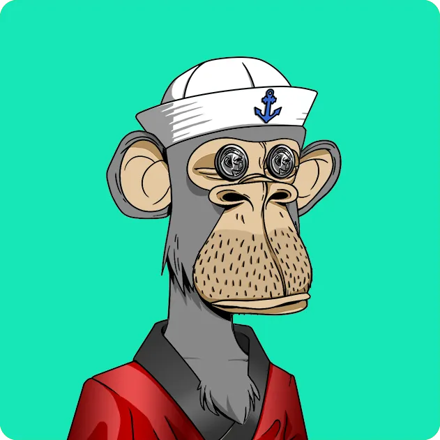
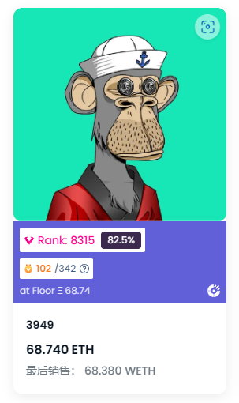
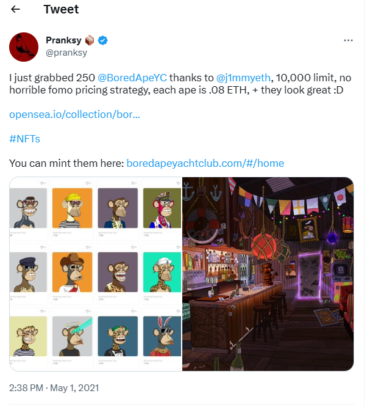
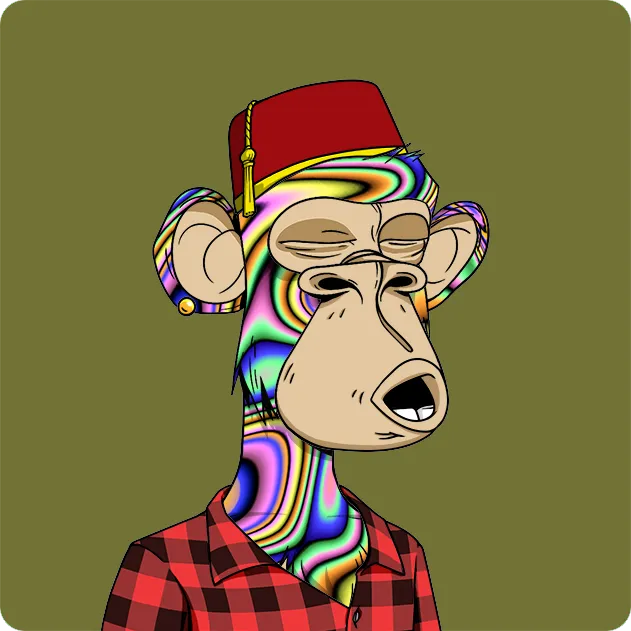

说实话，第一眼看到这个图，你可能并不会觉得这个图有多么出色，也许你会觉得这个可能是一个幼儿园小孩子的作品。实际上也并不能算很惊艳的作品，但是当你看到它的价格：

（防止你们对价格没有观念，截至2023.03.10，这个的价格约为$95,005.55）

好吧我觉得我可能要重新审视这个项目了，或许它的画风其实还挺不错的...

### BAYC

**Bored Ape Yacht Club**,通常大家喜欢叫它BAYC，或者Bored Ape，也就是无聊猿，虽然名字叫无聊，但是其实BAYC本身并不无聊。

BAYC根据etherscan.io区块链浏览器上的数据，诞生于Apr-22-2021 03:03:16 AM +UTC，最初铸造（Mint）价格仅为0.08ETH，总数量10000个，当时价格约为180$

短短一年，BAYC就达到了它的ATH(All time high)，but why？

让我们来剖析一下吧~~

#### pfp

pfp通常指profile picture, 也就是我们在社交平台上的大头照，而在区块链社群，pfp成为了可以交易的商品，亦或是个人身份的象征。
实际上，pfp的鼻祖应该是cryptopunk，而在cryptopunk之后诞生了很多很多的NFT项目，其中不乏很多优秀的产品，比如BAYC，以及Azuki
同时，在以太坊上的各种 NFT 类别中，PFP 占 NFT 总市值的 70%，生成艺术以 13.5% 位居第二，虚拟土地以 8% 位居第三。

实际上pfp项目并不少，有很多项目甚至已经没有任何流动性了，但是BAYC，Cryptopunk，Azuki这样的蓝筹（Blue-chip）却能够繁荣到现在。

### 区别在于？

实际上最初的BAYC并没有这么火热，虽然不能说无人问津，但是很长一段时间都没有被mint完。直到某一天...

那是5月的一天，2021年5月1日，知名收藏家 Pranksy 关注到了这个项目，并宣布已经购买了 250 多只猿猴。从他发布推特的那一刻起，BAYC 的销量、用户、交易数激增。就在仅仅 117 分钟后，BAYC 售罄。（KOL的威力）

之后，对于那些持有 BAYC 的 NFT的玩家，他们还相当于持有 BAYC 生态系统的会员卡，可以获得会员专属福利。毋庸置疑，它很受欢迎，好莱坞一线明星和 NBA 最佳球员都拿出大笔资金来拥有 BAYC NFT。

有很多著名的明星购买了BAYC，他们中的一些是：

- 马克·库班（Mark Cuban），亿万富翁、达拉斯小牛队老板、Shark Tank 创业导师。
- 史蒂芬·柯瑞（Stephen Curry），NBA金州勇士队球星、三届总冠军、两届MVP。
- 埃米纳姆（Eminem），美国说唱歌手、制作人、演员，被誉为“说唱之神”。
- 泰勒·斯威夫特（Taylor Swift），美国流行歌手、词曲作者，拥有11座格莱美奖。
- 乔纳·希尔（Jonah Hill），美国喜剧演员、导演、编剧，曾两次获得奥斯卡提名。

还有Justin Bieber、Paris Hilton、Snoop Dogg这些大家耳熟能详的明星成为了BAYC众多持有者之一，获得了自己Bored Ape的化身，地板价价格一度飙升到153.7ETH，而迄今为止最高价的交易是BAYC #1562，它以**200 WETH**的价格成交，约合**701,034 美元**。这是在2022年4月3日发生的，比BAYC当时的地板价高出了92%。这个BAYC有以下特征：

- Fur: Solid Gold
- Mouth: Gold Grill
- Eyes: Laser
- Hat: Captain's Hat
- Earring: Diamond Stud
- Background Color: Blue

随着BAYC的售罄，Yuga Labs 创建了「Mutant Ape Yacht Club」和「Bored Ape Kennel Club」，并对 BAYC 的持有者进行空投。

当然Yuga lab并没有止步于发图片，随着会员系统的壮大，目光被渐渐转移到去中心化自治组织 (DAO)，作为新兴社区的支柱。

ApeCoin（APE）是APE生态系统的治理代币，允许代币持有者参与ApeCoin DAO，并为其参与者提供一种共享且开放的货币，可以在没有中央化中介机构的情况下使用。62%的ApeCoin被分配给了生态系统基金，该基金将支持由ApeCoin DAO投票决定的社区驱动计划。

它是Bored Ape Yacht Club生态系统基于以太坊的代币。它已经正式发布并流通。NFT持有者可以认领这些代币，目前已经有9300万个代币被认领，价值约8.1亿美元。

而且实际上你愿意的话，你可以在一些商家处使用APE代币付款。例如，位于佛罗里达州的啤酒厂SaltWater Brewery宣布，如果使用APE代币付款，则可以以折扣价格购买其啤酒。APE代币持有者可以集体做出治理决策，投票并决定资金分配、规则制定、合作伙伴关系、项目选择等问题，最终由ApeCoin基金会实施社区做出的治理决策

BAYC同时也赋予了它的持有者很多商业价值，比如：

- BAYC与知名品牌Adidas达成合作，推出了限量版服饰、鞋子和NFT。
- BAYC与知名音乐人The Weeknd合作，推出了一首歌曲《Ape Shit》，并将其封面设计成无聊猿NFT。
- BAYC与知名游戏公司Ubisoft合作，将无聊猿NFT引入其游戏《Quartz》中，让玩家可以使用自己的NFT定制角色。

这使得图片不再是图片，而可以和一些实体产业挂钩，而非摆在链上的观赏品。

所以总而言之，为啥BAYC的社群比起其他的社群更有凝聚力，简而言之有以下几个原因：

- BAYC的社区成员都是无聊猿NFT的持有者，他们通过共同拥有一种稀缺和独特的数字收藏品，每个NFT都有不同的外观特征和属性，反映了持有者的个性和喜好。持有者可以把自己的NFT作为自己的头像或标志，展示自己是BAYC社区的一员，这样，他们就可以在数字世界中建立一种身份认同和归属感。
- BAYC的社区成员都可以享受会员专属的福利，无聊猿NFT不仅是一种数字收藏品，也是一种会员卡，它可以让持有者享受BAYC社区提供的各种福利。比如，持有者可以进入私密的聊天室，与其他持有者交流、互助、互动；也可以参与独家的活动和合作，比如与知名品牌、音乐人、游戏公司等进行跨界合作；还可以获取免费或优惠的衍生品，比如服饰、鞋子、歌曲、游戏角色等，这些福利可以增加持有者对BAYC社区的忠诚度和满意度。
- BAYC的社区成员都可以参与生态系统内项目和资金的决策，无聊猿NFT带来了治理代币，它可以让持有者参与BAYC社区内项目和资金的决策。通过创建ApeCoin作为治理代币，赋予持有者对生态系统内项目和资金的投票权。这样，持有者就可以实现对BAYC社区发展方向和未来愿景的共同决策，并分享其创造出来的价值。
- BAYC的社区成员都可以互相交流、互助、互动，形成了一种友好和积极的氛围，所以，除此以外，他也是一种文化符号，它反映了BAYC社区成员之间共享的价值观和信念。BAYC社区成员都以无聊猿为荣，并相互支持、鼓励、欢迎。他们在私密或公开的平台上进行各种形式的交流、互动、合作，并产生了许多有趣和创造性的内容。这些内容不仅丰富了BAYC社区本身，也吸引了更多外部人士关注并加入BAYC社区。

这便是一个完美的NFT社群的样子，实际上很多项目并不差，只是缺少KOL以及社区的凝聚力，在缺少共识以及凄凉的市场环境下，大部分项目仅仅只能作为一个Flip的手段，而非长期持有。

